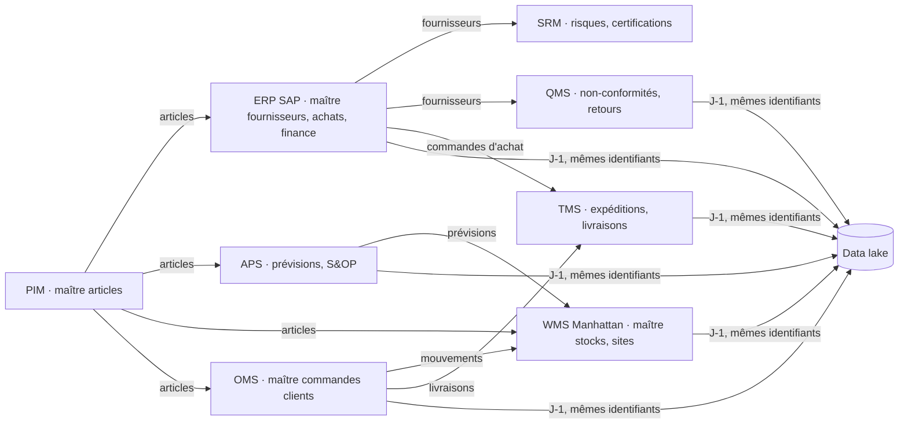

# Maison Lucie : SI de test multi-sources

Maison Lucie simule le SI d'un distributeur avec 9 applications indépendantes, chacune avec ses propres clés et ses propres erreurs. Il sert à tester la couche d'intégration d'Aura : connexion, métadonnées, mapping, rapprochement, cohérence et alertes.

## Le paysage applicatif (9 applications)

Toutes les ressources demandent l'en-tête `Authorization: Bearer <jeton passerelle>`. Le jeton public de démonstration est `lucie_aura_gateway_demo_token`, surchargeable par `LUCIE_GATEWAY_TOKEN`. Le catalogue est servi par `GET /api/sources/index`, sans authentification.

| Application | Rôle | Accès | Clés propres |
|---|---|---|---|
| ERP · SAP S/4HANA | achats, fournisseurs, finance (maître fournisseurs) | OData v2 : `/sap/opu/odata/sap/API_BUSINESS_PARTNER/A_Supplier`, `…/API_PURCHASEORDER_PROCESS_SRV/A_PurchaseOrderItem` | LIFNR (`0000100001`), EBELN |
| PIM | référentiel produit (maître produits) | REST : `/api/sources/pim?resource=products` | productId, EAN-13, identifiant fiscal fournisseur en saisie libre |
| WMS · Manhattan Active WM | stocks, entrepôts | REST : `/api/sources/manhattan?resource=inventory` (ou `facilities`) | ItemId en GTIN-14, FacilityId sans tiret (`WHPAR`) |
| TMS | transport, expéditions, transporteurs | REST : `/api/sources/tms?resource=shipments` | ShipmentId, `PO-…`, raison sociale libre, transporteur, mode |
| APS | planification, prévisions, S&OP | REST : `/api/sources/aps?resource=forecasts` | référence interne + site + semaine ISO |
| SRM · portail fournisseurs | évaluation, risques, certifications | REST : `/api/sources/srm?resource=suppliers` | SrmId, TVA « FR-12-… » ou DUNS |
| QMS | qualité, non-conformités, retours | REST : `/api/sources/qms?resource=nonconformities` | NcId, EAN, identifiant fiscal fournisseur |
| OMS | commandes clients | REST : `/api/sources/oms?resource=order-lines` ; fichier : `&format=csv` | référence interne (casse libre), OrderLineId |
| Data lake | historique des ventes | CSV : `/api/sources/lake?resource=sales&format=csv` ; agrégats : `?aggregate=1&groupBy=Ean,month` | EAN-13, code magasin (`btq_par_fsh`) |

Chaque interface a ses paramètres :

- **SAP (OData v2)** :
  - `$filter` (`eq`, `ne`, `gt`, `ge`, `lt`, `le`, `and`, `datetime'…'`) ;
  - `$select`, `$top`, `$skip`, `$inlinecount=allpages` ;
  - pagination `__next` ;
  - delta : `__delta` en fin de lecture, puis `!deltatoken=<horodatage>` ;
  - `$metadata` (EDMX) : `/sap/opu/odata/sap/<service>/$metadata`.
- **REST** :
  - `updatedAfter` ;
  - pagination par curseur (`limit`, `cursor`, `nextCursor`), ou page/size pour Manhattan (`page`, `size`, `header.hasMore`) ;
  - fenêtre temporelle `from` et `to` ;
  - filtre d'égalité sur tout champ.

## Schéma du SI : applications, flux et maîtres



| Domaine | Application maître | Applications qui le reprennent (même identifiant, normalisé) |
|---|---|---|
| Article | PIM (EAN, référence interne) | ERP (Material), WMS (GTIN-14), OMS (ProductRef), APS (Material), QMS (EAN), data lake (EAN) |
| Fournisseur | ERP SAP (LIFNR, SIRET/TVA/DUNS) | SRM (TaxId), QMS (SupplierTaxId), PIM (supplierTaxId), TMS (raison sociale) |
| Site | WMS (FacilityId) | OMS (FulfillmentSite), APS (Site), data lake (StoreCode) |
| Stock et mouvements | WMS | data lake (J-1) |
| Commande client | OMS | WMS (mouvements), TMS (livraisons), data lake (J-1) |
| Commande d'achat, expédition | ERP, TMS | data lake (J-1) |
| Prévision | APS | data lake (J-1) |
| Qualité | QMS | data lake (J-1) |

Le data lake est alimenté par les applications : flux `orders`, `stock`, `movements`, `purchases`, `transport`, `deliveries`, `forecasts` et `quality` (`/api/sources/lake?resource=<flux>`). Chaque ligne est une copie de la ligne d'origine, avec son application (`_source`) et une heure d'ingestion décalée d'un jour (`_ingestedAt`, J-1) ; les lignes plus récentes que J-1 n'y sont pas encore. Les ventes magasin (`sales`) portent l'EAN tel que le PIM le publie.

Une commande OMS génère un mouvement WMS par ligne (`wms_movements` : sortie si expédiée, réservation sinon) et une livraison TMS par commande (`tms_deliveries`).

`scripts/test-coherence.mjs` vérifie l'intégrité référentielle entre toutes les applications, hors erreurs volontaires : exhaustivement en taille démo, par échantillon de 3 000 lignes par table en taille scale.

## Deux tailles, un seul générateur

`lib/multisource-gen.js` calcule chaque ligne à partir de son seul rang, avec une graine fixe. Le même code sert :

- à la **taille démo** (`npm run generate:demo`), écrite dans `data/multisource-demo.json`, versionnée et servie en ligne avec tous les filtres ;
- aux **API à grande échelle**, en ajoutant `size=scale` à toute ressource. Les millions de lignes sont générés à la volée, page par page (1 000 lignes au plus, mises en cache CDN un jour, 60 requêtes par minute au plus). Rien n'est stocké ni sur git ni sur Vercel. Seule la pagination est offerte ; `$filter`, `updatedAfter` et `aggregate` renvoient 400 ;
- au **Parquet** (`npm run generate:scale`), qui écrit dans `/tmp/maison-lucie-scale` (230 s, 520 Mo). Le lac y est partitionné par mois.

La génération Parquet utilise, pour les six premières applications, la même logique écrite en SQL DuckDB ; APS, SRM et QMS sont écrits depuis le générateur JavaScript (`scripts/multisource-sql.mjs`, hachage `h32` identique). `scripts/test-generator-equivalence.mjs` vérifie que JavaScript et SQL donnent exactement les mêmes lignes, table par table.

| Table | Démo | Scale |
|---|---|---|
| sap_suppliers | 63 | 5 025 |
| sap_purchase_orders | 800 | 1 000 000 |
| pim_products | 1 200 | 1 000 000 |
| wms_facilities | 12 | 500 |
| wms_stock | 3 600 | 5 000 000 |
| tms_shipments | 800 | 1 000 000 |
| aps_forecasts | 3 600 | 1 200 000 |
| srm_suppliers | 60 | 5 000 |
| qms_nonconformities | 400 | 200 000 |
| wms_movements | 3 000 | 10 000 000 |
| tms_deliveries | 1 001 | 3 333 334 |
| oms_order_lines | 3 000 | 10 000 000 |
| lake_sales | 4 000 | 50 000 000 |

## Erreurs volontaires

Les erreurs sont injectées par des règles déterministes. La vérité terrain est recalculée à chaque génération, dans le champ `groundTruth` du JSON ou du manifeste.

| Erreur | Source | Démo | Scale | Ce qu'Aura doit faire |
|---|---|---|---|---|
| Fournisseur en double (autre LIFNR, raison sociale en majuscules + « SAS », SIRET ou TVA espacés) | SAP | 3 | 25 | détecter le doublon par clé fiscale normalisée |
| Produit au fournisseur inconnu (identifiant fiscal `FR99…`) | PIM | 6 | 3 003 | orphelin du lien produit → fournisseur |
| EAN en double | PIM | 4 | 2 000 | conflit : aucun rattachement arbitraire |
| TVA en minuscules avec espaces, DUNS avec tirets | PIM | — | — | normaliser |
| GTIN inconnu (préfixe `0399`) | Manhattan | 5 | 5 000 | orphelin |
| Site `WHXXX` inconnu | Manhattan | 2 | 1 000 | orphelin |
| GTIN-14 et FacilityId sans tiret | Manhattan | — | — | normaliser (EAN-13, `WH-PAR`) |
| Raison sociale variante (`TESSITURA MILANO Ltd`) | TMS | 8 | 4 368 | ressemblance en file de validation, jamais appliquée seule |
| Référence en minuscules | OMS | 60 | 200 000 | normaliser |
| Code magasin `btq_par_fsh` | lac | — | — | normaliser |
| Pays fournisseur différent de SAP | PIM | 3 | 218 | écart de fond, signalé dans la preuve des alertes |
| Prévision sur une référence inconnue (`ML-9…`) | APS | 7 | 1 200 | orphelin |
| Certification expirée | SRM | 5 | 454 | à signaler dans le risque fournisseur |
| TVA « FR-12-… », nom « (groupe) » | SRM | — | — | normaliser, rapprocher |
| Non-conformité sur un EAN inconnu | QMS | 4 | 2 061 | orphelin |
| Commande `PO-4500000001` (TMS) contre `4500000001` (SAP) | TMS | — | — | normaliser |

## Récit de démonstration

Le récit reprend les 15 fournisseurs et les 20 articles des alertes existantes (`SUP-001` Tessitura Milano, `CLASP-AURORA`…). Tessitura Milano et Shenzhen Atelier Components ont un taux de retard élevé, et des articles du récit sont en rupture sur un site. Les alertes existantes (`ALT-*`, jeux `lib/demo-data.js`) sont inchangées et restent reproductibles.

## Tests

```bash
npm run test:multisource   # contrats OData/REST/lac, erreurs volontaires, taille scale à la volée, $metadata, équivalence JS/SQL
npm test                   # tous les tests (le smoke test demande le serveur local : npm start)
```
